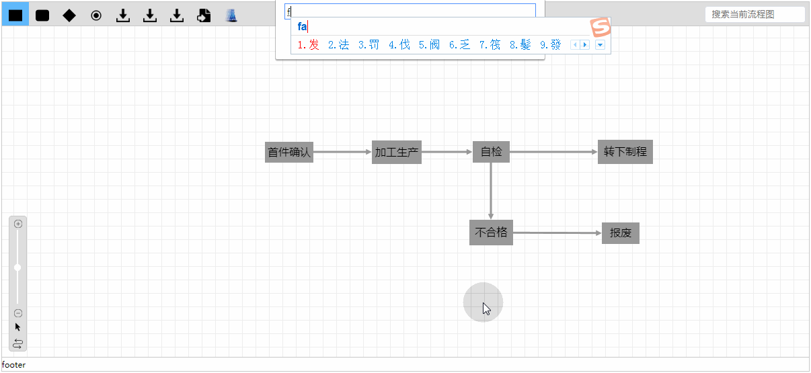
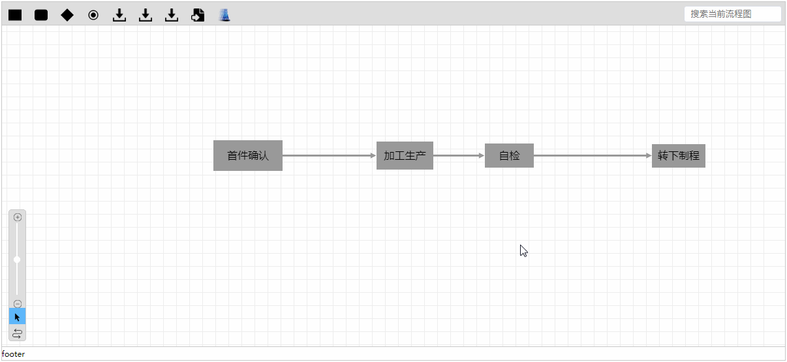

# flow-chart-editor

[](https://www.npmjs.com/package/flow-chart-editor)
[](https://npmjs.org/package/flow-chart-editor)


[](https://gitter.im/tlzzu/flow-chart-editor?utm_source=badge&utm_medium=badge&utm_campaign=pr-badge&utm_content=badge)

基于[cytoscape.js](https://github.com/cytoscape/cytoscape.js)的流程设计器，优点是可以在流程节点中嵌套子流程，支持实/虚线、连线弯曲、撤销重做、放大缩小，导出 json/png/jpg 文档等。[演示文档 Demo](https://tlzzu.github.io/flow-chart-editor/dist/index.html)

> 在此，感谢 easyicon.net 提供的图标。

[1. 预览-Preview](#1-预览-preview)

[2. 安装使用-Install](#2-安装使用-install)

[3. 二次开发-Build](#3-二次开发-build)

[4. 文档-Document](#4-文档-document)

[5. 依赖-Dependencies](#5-依赖-dependencies)

[6. 捐赠-Donation](#6-捐赠-donation)

[7. 许可证-LICENSE](#7-许可证-license)

## 1. 预览-Preview

预览效果如下：



## 2. 安装使用-Install

### npm 安装

推荐使用 npm 安装

```
npm i flow-chart-editor -S
```

可在页面中引用

```
import FCE from "flow-chart-editor";

var fce=new FCE({
  el: document.getElementById("fce"),//初始化节点
  toolbars: [{//自定义toolbar
      name: "rectangle",//节点名称
      icon: "images/rectangle.png",//toolbar的图片
      className: "",//自定义样式
      title: "矩形",//title值
      exec(evt, clickType, obj) {//选中该节点后，点击编辑区域后被触发事件
        const label = prompt("请输入节点名称："),
          data = { id: new Date().getTime(), label: label };
        if (!label) return;
        if (clickType === "node") {
          data.parent = obj.id;
        }
        this.addNode(data, "rectangle");
      }
    },  
    "animation"]//这里FCE内置的一种制作流程动画组件
  });
```

### 脚本引用

```
<!DOCTYPE html>
<html>
  <head>
    <title>flow-chart-editor流程编辑器</title>
    <link href="css/cytoscape-context-menus.css" rel="stylesheet">
    <link href="css/fce.1.0.0.min.css?a643cc98a261f0b1586b" rel="stylesheet">
    <script type="text/javascript" src="js/lib/cytoscape.js"></script>
    <script type="text/javascript" src="js/lib/jquery.js"></script>
    <script type="text/javascript" src="js/lib/konva.min.js"></script>
    <script type="text/javascript" src="js/lib/cytoscape-node-resize.js"></script>
    <script type="text/javascript" src="js/lib/cytoscape-grid-guide.js"></script>
    <script type="text/javascript" src="js/lib/cytoscape-edgehandles.js"></script>
    <script type="text/javascript" src="js/lib/cytoscape-context-menus.js"></script>
    <script type="text/javascript" src="js/lib/cytoscape-edge-bend-editing.js"></script>
    <script type="text/javascript" src="js/lib/cytoscape-undo-redo.js"></script>
    <script type="text/javascript" src="js/lib/cytoscape-view-utilities.js"></script>
    <script type="text/javascript" src="js/fce.1.0.0.min.js?a643cc98a261f0b1586b"></script>
  </head>
  <body>
    <div id="fce"></div>
    <script>
      var fce=new FCE({
        el: document.getElementById("fce"),//初始化节点
        toolbars: [{//自定义toolbar
          name: "rectangle",//节点名称
          icon: "images/rectangle.png",//toolbar的图片
          className: "",//自定义样式
          title: "矩形",//title值
          exec(evt, clickType, obj) {//选中该节点后，点击编辑区域后被触发事件
            const label = prompt("请输入节点名称："),
              data = { id: new Date().getTime(), label: label };
            if (!label) return;
            if (clickType === "node") {
              data.parent = obj.id;
            }
            this.addNode(data, "rectangle");
          }
        },  
        "animation"]//这里FCE内置的一种制作流程动画组件
      });
    </script>
  </body>
</html>
```

## 3. 二次开发-Build

二次开发前请确保已经安装`node`及`webpack`。在控制台中执行 `npm run <target>`，其中：

* `dev`：开发模式，执行后可直接访问[http://localhost:9110/](http://localhost:9110/)直接调试。
* `build`：执行打包，dist 中的文件会重新打包。

## 4. 文档-Document

```
//todo 稍后完善。
```

## 5. 依赖-Dependencies

[jquery ^3.2.1](https://github.com/jquery/jquery)

[cytoscape ^3.2.0](https://github.com/cytoscape/cytoscape.js)

[cytoscape-context-menus ^3.0.5](https://github.com/iVis-at-Bilkent/cytoscape.js-context-menus)

[cytoscape-edge-bend-editing ^1.5.4](https://github.com/iVis-at-Bilkent/cytoscape.js-edge-bend-editing)

[cytoscape-edgehandles ^3.0.2](https://github.com/cytoscape/cytoscape.js-edgehandles)

[cytoscape-grid-guide ^2.0.5](https://github.com/iVis-at-Bilkent/cytoscape.js-grid-guide)

[cytoscape-view-utilities ^2.0.7](https://github.com/iVis-at-Bilkent/cytoscape.js-view-utilities)

[cytoscape.js-undo-redo ^1.0.1](https://github.com/iVis-at-Bilkent/cytoscape.js-undo-redo)

## 6. 捐赠-Donation

表示您对本项目的支持


## 7. 许可证-LICENSE

MIT.
